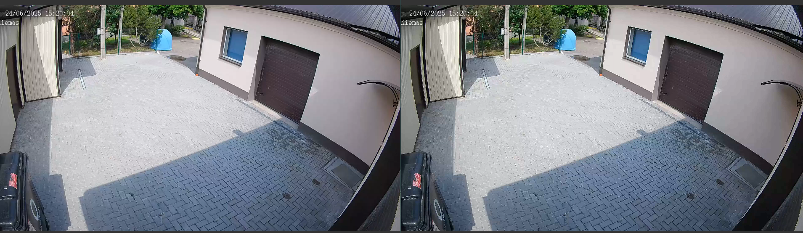

# SuperResolution.axera
SuperResolution DEMO on Axera

- 开源超分模型
- 目前支持  Python 语言 
- 预编译模型下载[Huggingface](https://huggingface.co/AXERA-TECH/SuperResolution)。如需自行转换请参考[模型转换](/model_convert/README.md)

## 支持平台

- [x] AX650N
- [ ] AX630C

## 模型转换

[模型转换](./model_convert/README.md)

## 上板部署

- AX650N 的设备已预装 Ubuntu22.04
- 以 root 权限登陆 AX650N 的板卡设备
- 链接互联网，确保 AX650N 的设备能正常执行 `apt install`, `pip install` 等指令
- 已验证设备：AX650N DEMO Board

### Python API 运行

#### Requirements

```
cd python
pip3 install -r requirements.txt
``` 

#### 运行

##### 基于 ONNX Runtime 运行  
可在开发板或PC运行 

在开发板或PC上，运行以下命令  
```  
cd python
python3 run_onnx.py --model ./edsr_baseline_x2_1.onnx --scale 2 --dir_demo ./test_1920x1080.mp4
```

输出结果
```
/usr/local/lib/python3.8/dist-packages/onnxruntime/capi/onnxruntime_inference_collection.py:69: UserWarning: Specified provider 'CUDAExecutionProvider' is not in available provider names.Available providers: 'AzureExecutionProvider, CPUExecutionProvider'
  warnings.warn(
100%|█████████████████████████████████████████| 267/267 [02:17<00:00,  1.95it/s]
Total time: 58.280 seconds for 267 frames
Average time: 0.218 seconds for each frame
``` 


##### 基于AXEngine运行  
在开发板上运行命令

```
cd python  
python3 run_axmodel.py --model ./edsr_baseline_x2_1.axmodel --scale 2 --dir_demo ./test_1920x1080.mp4
```

输出结果
```
[INFO] Available providers:  ['AxEngineExecutionProvider']
[INFO] Using provider: AxEngineExecutionProvider
[INFO] Chip type: ChipType.MC50
[INFO] VNPU type: VNPUType.DISABLED
[INFO] Engine version: 2.12.0s
[INFO] Model type: 2 (triple core)
[INFO] Compiler version: 4.2 6bff2f67
100%|█████████████████████████████████████████| 267/267 [10:06<00:00,  2.27s/it]
Total time: 99.582 seconds for 267 frames
Average time: 0.373 seconds for each frame
```



运行参数说明:  
| 参数名称 | 说明  |
| --- | --- | 
| --model | 模型路径 | 
| --scale | 超分尺度 | 
| --dir_demo | 测试数据路径 | 
| --rgb_range | 颜色空间范围 | 

### Latency

#### AX650N

| model | latency(ms) |
|---|---|
|EDSR|800|
|ESPCN|22|


## 技术讨论

- Github issues
- QQ 群: 139953715
